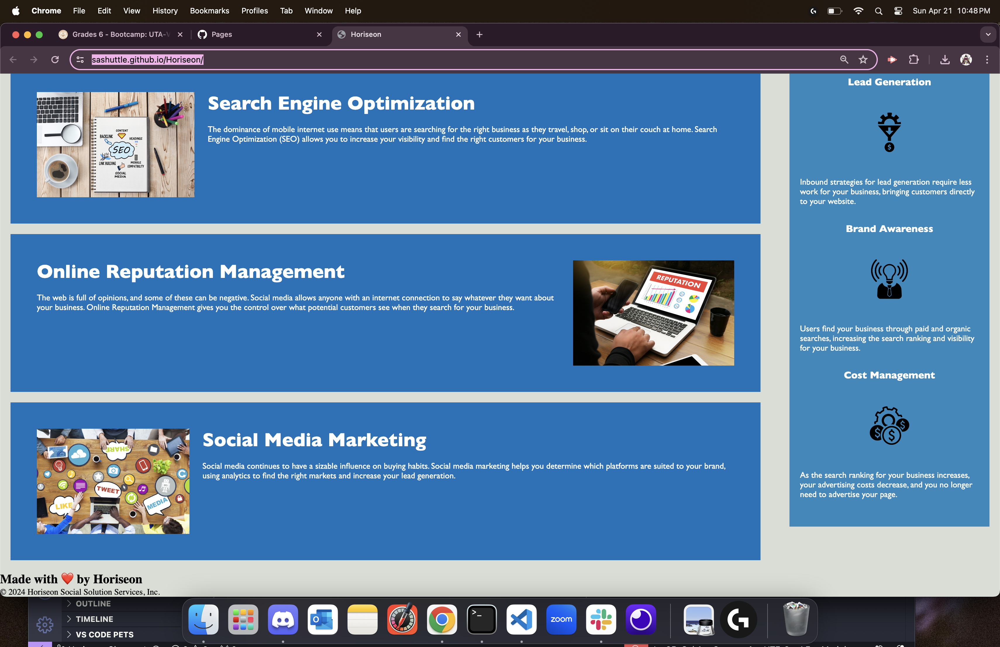

# Horiseon
The purpose of Horiseon (Challenge 1) is to display the basic knowledge and understanding of HTML and CSS. It replicates a possible job ticket that I would get as a junior developer in the work force.

## Features
ACCESSABILITY: Images displayed throughout the webpage have an "alt" attribute.  When the user hovers overs the pictures a 
description of the image will be displayed. 

CLEAN CODE: Althought most of the code was provided throughout this challenge, I made sure that the code was organized and understandable.  There are also notes throughout the code to assist anyone who reviews this code in the future. 

ACKNOWLEDGEMENT: There is an acknowledgement section within the README givng credit to anyone who helped me with this challenge.

## Technologies Used
    Visual Studio Code
        This is the program used to write all HTML and CSS code.  Below are the links to the website and their license.
        https://code.visualstudio.com/
        https://code.visualstudio.com/License/

    Github
        This program was used to upload my code so it is saved and othersr can look through the code.  Below are the links to the website and license.
        https://www.github.com
        https://docs.github.com/en/site-policy/github-terms/github-terms-of-service

    Xpert Learning Assistant
        The Xpert Learning Assistant is a chat AI program created by the Full-Stack Web Development program to assist students, like myself, with any questions they may have.

## Installation
N/A

## License
MIT

## Acknowledgements
I would like to thank my brother in law, John Brooks, a Full Stack Developer I, who helped me on this challenge. 

## Live URL & Screenshot
URL: https://sashuttle.github.io/Horiseon/

## Contact Info
example_email@example.com 